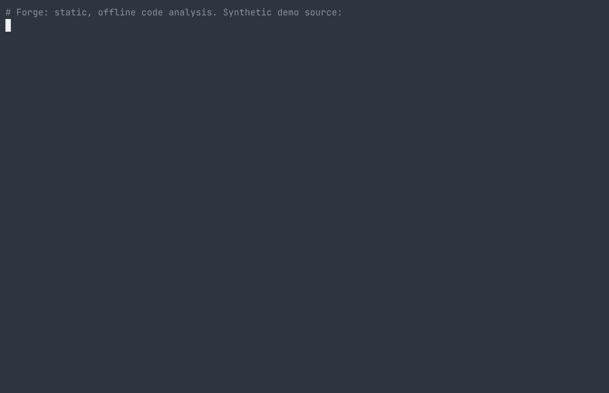

# Forge

Forge is a local, deterministic, model-free static-analysis workbench for **Python source code**. It reads Python files you explicitly give it (plain files, ZIPs, notebooks and Python code blocks in text files), records structure (definitions, classes, imports, calls) and the call sites of APIs you name in a data-only profile, lets you search that metadata, and packages source-identified leads for human review. Files in other languages are listed but not analysed.

It never executes the code it inspects and makes no model calls. Analysis is fully offline: no command in this README touches the network. The only network feature is optional, operator-started GitHub discovery of public example code; see [docs/THREAT_MODEL.md](docs/THREAT_MODEL.md) for exactly what it sends and its limits.

[](LICENSE)



<sub>The demo above runs `examples/demo/run_demo.py` and `corpus-search` on the bundled synthetic source. A replayable recording is in [`docs/media/forge-demo.cast`](docs/media/forge-demo.cast) (`asciinema play docs/media/forge-demo.cast`).</sub>

**Using an AI coding agent?** Point it at [`AGENTS.md`](AGENTS.md). It has tested, step-by-step instructions for running Forge on a Python codebase and reading the results.

## Features

- **Static, read-only analysis.** Hound parses Python source and reports a call only when it can bind it to a declared import. It never imports or runs the code it inspects.
- **Data-only API profiles.** You list the exact APIs you care about in a JSON profile; no plugins or code hooks.
- **Mixed-source corpus intake.** Plain files, ZIP archives, notebooks and saved transcripts, each pinned by size and SHA-256 in a manifest.
- **Local search.** BM25 with reciprocal-rank fusion over definitions, imports and call sites, backed by SQLite FTS5.
- **Local web UI.** `forge.py serve` binds to `127.0.0.1` only.
- **Review packets.** Results are packaged as source-identified leads with hashes so a person can check every claim.
- **Offline and reproducible.** Analysis makes no network requests or model calls, and Forge has no third-party Python dependencies. Analyzer files are hash-pinned and verified on every workspace.
- **Opt-in public discovery.** `forge.py run` (or **Run** in the UI) can search GitHub for public, permissively licensed example code with bounded, GET-only requests. It never runs unless you start it. See [docs/THREAT_MODEL.md](docs/THREAT_MODEL.md).

## Project layout

| Path | Component |
|---|---|
| `forge.py`, `forge_core/` | The Workbench: CLI, local web UI (`serve`), mixed-source corpus intake (plain files, ZIPs, notebooks, saved transcripts), BM25 + reciprocal-rank-fusion search, dependency context, Opportunity Lab, reuse review and contract (JSON canonicalization) trial. |
| `hound/` | Hound, the read-only static analyzer. It reports a call only when it can bind it back to a declared import, and refuses ambiguous, conditional or rebound imports. |
| `addon/` | The configurable exact-API probe that runs Hound on one source inside a resource-limited worker. |
| `loop/` | The controlled improvement loop: evaluates data-only profile proposals against a fixed contract and keeps failed work. |
| `runner/` | The research runner: bounded multi-source research missions with checkpoints, producing a compact review packet. |
| `examples/demo/` | Public demo pack. Synthetic data only. |
| `tests/`, `tools/`, `contracts/`, `templates/`, `assets/` | Test suite, maintenance tools, frozen test contracts, profile templates and web UI assets. |

The layers reflect how Forge grew. [docs/ARCHITECTURE.md](docs/ARCHITECTURE.md) explains which component owns what.

The analyzer (`loop/`, `addon/`, `hound/`) ships as plain source. Each component has a `SHA256SUMS.txt`, and `contracts/analyzer_lock.json` pins those manifests. When you create a workspace, Forge copies the analyzer into the workspace and verifies every file. After an intentional analyzer change, run `python3 tools/update_analyzer_manifests.py` and review the diff.

## Installation

- Python 3.11 or newer with SQLite FTS5 (standard in most builds). No third-party Python packages.
- A POSIX system (Linux or macOS). Windows is not supported.
- Node.js is optional. It is used only by the full qualification (`verify.py`) as an independent JSON canonicalization reference.

There is nothing to install. Clone the repository and run it with Python:

```sh
git clone <this repository URL> forge
cd forge
python3 forge.py --help
```

On macOS you can also double-click `Start_FORGE.command` (or run `./Start_FORGE.sh` on Linux) to open the local web UI.

## Quick start

```sh
# Run the bundled demo end to end (scan, search, opportunity case study)
python3 examples/demo/run_demo.py --out /tmp/forge-demo

# Or drive the CLI yourself
python3 forge.py --home /tmp/forge-home init
python3 forge.py --home /tmp/forge-home corpus-run --source-root examples/demo/src \
    --manifest examples/demo/manifest.json --run-id demo --profile examples/demo/profile.json
python3 forge.py --home /tmp/forge-home corpus-search --run-id demo --query "pickle load"
python3 forge.py --home /tmp/forge-home serve          # web UI on 127.0.0.1
```

See `examples/demo/README.md` for how to point Forge at your own code. A workspace (`--home`) must be outside the repository. The default is `~/.forge-workbench-0.8.4` (a fixed folder name, not the release version).

## Running the tests

```sh
python3 run_tests.py --out /tmp/forge-tests             # Workbench suite (785 tests)
python3 hound/run_tests.py --out /tmp/hound-tests       # Hound suite (483 tests)
(cd runner && python3 -m unittest discover -s tests)   # Research runner (64 tests)
python3 runner/run_demo.py --out /tmp/forge-research    # Research runner demo mission
python3 verify.py --out /tmp/forge-qualification        # Full qualification (all of the above plus the controlled cycle, contract trial and self-recovery trial)
```

Output folders must be new and outside the repository.

### Continuous verification

Every push to `main` and every pull request runs the same checks in GitHub Actions ([`.github/workflows/qualification.yml`](.github/workflows/qualification.yml)) on Python 3.11 and 3.13: the pre-publish check over the full git history, the full qualification (`verify.py`), the research-runner tests and both demos. Each run publishes its evidence (the `verify.py` output, test logs, demo output, `provenance.json` and `SHA256SUMS.txt`) as a workflow artifact named `forge-verification-<commit-sha>-py<version>`, bound to the exact commit it checked. Branch protection on `main` requires these checks to pass. CI evidence comes from the project's own pipeline, so it shows the checks ran on that commit; it is not an independent evaluation.

## Limits

- Results are static observations and lexical leads, not runtime guarantees, quality scores or permission to reuse code. A missing match does not prove a capability is absent.
- Resource limits on parsing are consistency controls, not a hostile-code sandbox. Only scan code you are allowed to read.
- Forge's secret-pattern checks (discovery search text, sensitive file names, `tools/prepublish_check.py`) are accidental-disclosure linting, not a credential-separation or DLP boundary. See [docs/THREAT_MODEL.md](docs/THREAT_MODEL.md).
- The Opportunity Lab produces rule-based hypotheses from reviewed inputs. It does not validate a market, clear prior art, or give legal advice.

## Before publishing a fork

`tools/prepublish_check.py` scans every file (and, optionally, git history) for common secret formats, absolute home-directory paths and a denylist of terms you supply in a file outside the repository. It is a lint for accidental disclosure, not a guarantee that nothing sensitive remains:

```sh
FORGE_DENYLIST=/path/outside/repo/denylist.txt python3 tools/prepublish_check.py --history
```

## Contributing

Contributions are welcome. Please read [CONTRIBUTING.md](CONTRIBUTING.md) before opening a pull request. In short: keep changes small, add or update tests, run `verify.py` locally, and do not add third-party runtime dependencies.

## Security

Please do not report security problems in public issues. See [SECURITY.md](SECURITY.md) for how to report them privately.

## Versions

The current release is **0.8.4** (`python3 forge.py --version`). Hound, the add-on, the loop and the runner carry their own component versions; see [docs/VERSIONS.md](docs/VERSIONS.md).

## License

Apache License 2.0. See `LICENSE` and `NOTICE`. Copyright 2026 Forge contributors.
